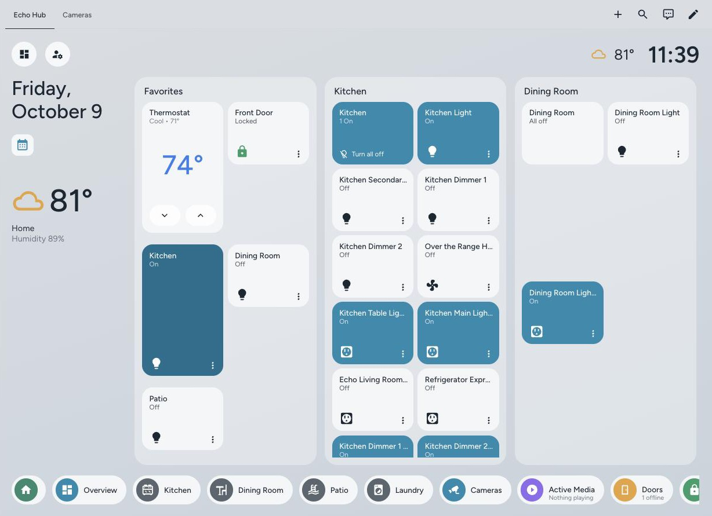
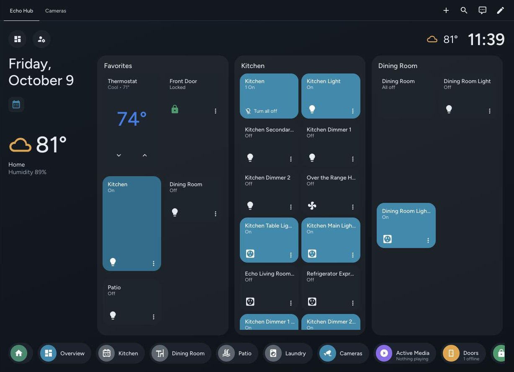

# Echo Hub

[](https://github.com/DynamotechLLC/echo-hub/actions/workflows/ci.yml)
[](https://hacs.xyz/docs/faq/custom_repositories)

A wall-panel dashboard for Home Assistant in the style of the Amazon Echo Hub: a clock and weather bar, a date column, a row of swipeable panels (Favorites, one per room, Cameras) and a dock of status pills. It is built for a tablet on the wall, and works on any screen.

| Light | Dark |
|---|---|
|  |  |

## Choose how to install

All three options draw the same dashboard from the same templates (`src/templates.yaml`).

| Option | Setup | Updates | Needs | Customise |
|---|---|---|---|---|
| 1. Strategy | 2 lines of YAML | HACS | button-card | the option keys below |
| 2. Generator | edit `layout.yaml`, run Python | re-run and paste | + auto-entities, Python 3.9+, PyYAML | every key |
| 3. Copy-paste | edit area ids by hand | re-paste | + auto-entities | by hand |

**Most people should use the strategy.** It finds your rooms, cameras, doors, lock, thermostat and weather by itself, and new devices appear without editing anything.

## Requirements

- Home Assistant 2024.8.0 or newer, and [HACS](https://hacs.xyz).
- [button-card](https://github.com/custom-cards/button-card): all options.
- [auto-entities](https://github.com/thomasloven/lovelace-auto-entities): options 2 and 3.
- Optional: [Advanced Camera Card](https://github.com/dermotduffy/advanced-camera-card) for the Cameras view (otherwise the built-in picture cards are used), and [kiosk-mode](https://github.com/NemesisRE/kiosk-mode) for wall panels.

Install each one the same way: HACS → search the name → **Download** → reload the browser.

## Step 1, for every option: install the theme

The colours come from the **Echo Hub** theme, in its own repository.

1. HACS → ⋮ → **Custom repositories** → add `DynamotechLLC/echo-hub-ha-theme`, category **Theme**.
2. Open **Echo Hub Theme** → **Download**.
3. Developer tools → **Actions** → run `frontend.reload_themes`.

`configuration.yaml` must load themes from the `themes` folder:

```yaml
frontend:
  themes: !include_dir_merge_named themes
```

Optional font: add `https://fonts.googleapis.com/css2?family=Figtree:wght@400;500;600&display=swap` as a dashboard resource of type **Stylesheet** (Settings → Dashboards → ⋮ → Resources).

Pick it: Profile → **Browser settings** → **Theme** → **Echo Hub**.

## Option 1: Strategy

1. HACS → ⋮ → **Custom repositories** → add `DynamotechLLC/echo-hub`, category **Dashboard** → **Download** → reload the browser.
2. Settings → Dashboards → **Add dashboard** → **Echo Hub**. Or create a dashboard from scratch, open it, ⋮ → **Edit dashboard** → ⋮ → **Raw configuration editor**, and replace everything with:

```yaml
strategy:
  type: custom:echo-hub
```

Every option is optional:

| Key | Default | Meaning |
|---|---|---|
| `favorites` | thermostat, lock, first camera | Tiles in the Favorites panel: entity ids, or `{entity, name, template}`. Lights, fans, switches, media players, locks, cameras and thermostats get their own tile; anything else gets a plain tile that opens its details |
| `rooms` | every area with lights, fans, switches or media players, by name | `{area, title, icon, extra}`; `extra` adds entities from outside the area |
| `cameras` | every camera | Camera entity ids, or `{entity, name, ptz}` |
| `doors` | binary sensors with device class door, garage door or opening | Shown in the Doors pill |
| `lock` | first lock | Lock pill |
| `climate` | first climate entity | Climate pill |
| `weather` | first weather entity | Clock bar and date column; `null` hides the weather |
| `forecast_sensor` | none | Adds today's high and low (see [forecast sensor](#optional-forecast-sensor)) |
| `media_exclude` | `["media_player.this_device*", "media_player.everywhere"]` | Media players not counted by the Active Media pill (`*` is a wildcard) |
| `kiosk_users` | `[]` | User names that get kiosk mode (needs kiosk-mode) |
| `camera_card` | `advanced` if Advanced Camera Card is installed, else `picture` | Cameras view card |
| `overview_path` | `/lovelace` | Where the Overview pill goes |

Example:

```yaml
strategy:
  type: custom:echo-hub
  favorites:
    - climate.thermostat
    - lock.front_door
    - {entity: light.kitchen, name: Kitchen, template: echo-light-tall}
  rooms:
    - {area: living_room, title: Living Room, icon: "mdi:sofa"}
    - {area: kitchen, title: Kitchen, icon: "mdi:stove"}
  cameras: [camera.front_door]
  kiosk_users: ["Tablet"]
```

## Option 2: Generator

```bash
git clone https://github.com/DynamotechLLC/echo-hub   # or download the ZIP
cd echo-hub
python3 -m pip install pyyaml
cp generator/layout.example.yaml layout.yaml
# edit layout.yaml: same keys as the table above; rooms and cameras must be listed
python3 generator/generate.py layout.yaml > echo-hub.yaml
```

Create a dashboard, open ⋮ → **Edit dashboard** → ⋮ → **Raw configuration editor**, paste `echo-hub.yaml` and **Save**. Mistakes stop the run with a message on stderr, for example `ValueError: unknown layout keys: favourites`.

## Option 3: Copy-paste YAML

Open [`yaml/echo-hub.yaml`](yaml/echo-hub.yaml), press **Raw**, copy everything, and paste it into a new dashboard's **Raw configuration editor**. Then change:

- each `area:` (`living_room`, `kitchen`, `bedroom`, `office`) to your area ids, and the room titles and icons in the room panels and in the `nav_` pills;
- the `favorites` panel entities;
- the camera entities, or delete the Cameras panel, the `nav_cameras` pill and the Cameras view;
- the `doors`, `lockpill` and `climate` pill entities;
- `weather.home`.

Area ids are under Settings → Areas, labels & zones → the area → ⋮ → Settings.

## Wall panel

1. Create a non-admin user for the tablet and log in with it.
2. On the tablet, Profile → Theme → **Echo Hub**.
3. Add the user's name to `kiosk_users` (needs kiosk-mode). Open the dashboard with `?disable_km` to get the header and sidebar back.
4. Keep the screen awake with the Companion app's screen settings or Fully Kiosk Browser.

## Optional forecast sensor

Weather entities no longer carry the forecast as an attribute. This trigger template keeps today's high as its state and the low as attribute `low`. Add it to `configuration.yaml`, change `weather.home`, restart, then set `forecast_sensor: sensor.daily_forecast`.

```yaml
template:
  - trigger:
      - trigger: time_pattern
        minutes: /30
      - trigger: homeassistant
        event: start
    action:
      - action: weather.get_forecasts
        target:
          entity_id: weather.home
        data:
          type: daily
        response_variable: fc
    sensor:
      - name: Daily forecast
        unique_id: daily_forecast
        state: "{{ fc['weather.home'].forecast[0].temperature }}"
        attributes:
          low: "{{ fc['weather.home'].forecast[0].templow }}"
```

## Troubleshooting

- **"Echo Hub needs button-card…"**: install the named card from HACS, then reload the browser.
- **Grey or blank tiles**: button-card is missing, or the Echo Hub theme is not selected.
- **No rooms**: assign devices to areas. Rooms with only sensors are skipped.
- **Clock frozen**: reload the page; it updates every 20 seconds.
- **Cameras view empty**: set `cameras:`, or install Advanced Camera Card.
- **A configuration switch shows in a room** (options 2 and 3, or an integration that sets no entity category): hide it: Settings → the entity → **Visible** off.

## Updating

Strategy: HACS shows the update; download it and reload. Generator: `git pull`, re-run and re-paste. Copy-paste: re-copy `yaml/echo-hub.yaml` and redo your edits.

## Uninstalling

Delete the dashboard, then remove Echo Hub (and the theme, if unused) in HACS.

## License

[MIT](LICENSE) © 2026 DynamotechLLC

## Credits

Built on [button-card](https://github.com/custom-cards/button-card), [auto-entities](https://github.com/thomasloven/lovelace-auto-entities), [Advanced Camera Card](https://github.com/dermotduffy/advanced-camera-card) and [kiosk-mode](https://github.com/NemesisRE/kiosk-mode).
